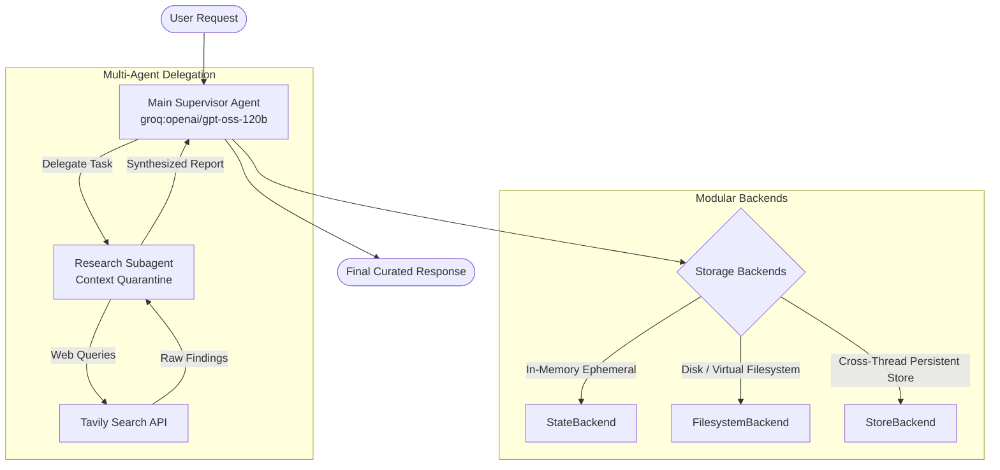

# 🤖 DeepAgentsModule: Production-Grade Agentic AI Architecture

[](https://www.python.org/)
[](https://github.com/langchain-ai)
[](https://groq.com/)
[](https://tavily.com/)
[](LICENSE)

An end-to-end framework and research implementation demonstrating **Deep Agentic AI systems**: from autonomous tool-calling and customizable persistence backends to multi-agent supervisor architectures with context quarantine.

---

## 🌟 Overview

As AI agents transition from simple single-turn prompt wrappers into autonomous systems executing long-horizon tasks, three core architectural challenges emerge:
1. **Tool Execution & Reasoning**: Orchestrating dynamic tool execution without hallucination or tool-parser collapse.
2. **State & Memory Isolation**: Managing persistence across threads without polluting the operational context.
3. **Supervisor-Subagent Hierarchy**: Scaling research and complex reasoning through delegated specialist subagents.

**`DeepAgentsModule`** implements and benchmarks these core pillars using **DeepAgents**, **LangGraph**, **Groq LPU high-speed inference**, and **Tavily AI Search**.

---

## 🏗️ Core Architecture & Capabilities



---

## 📂 Repository Structure

```plaintext
DeepAgentsmodule/
├── deepagentsdemo/
│   ├── 1-basicdeepagent.ipynb    # Autonomous deep agent with Tavily web search
│   ├── 2-backends.ipynb          # StateBackend vs FilesystemBackend vs StoreBackend
│   ├── 3-subagents.ipynb         # Supervisor-Subagent pattern & Deep Research
│   └── notes/                    # Real disk persistence test outputs
├── src/
│   └── deepagentsmodule/         # Core Python package modules
├── .env.example                  # Environment template for API keys
├── pyproject.toml                # Project metadata and dependencies (uv / pip)
├── requirements.txt              # Pinned requirements
└── README.md                     # Comprehensive documentation
```

---

## 🚀 Key Modules & Demonstrations

### 1. Fundamental Deep Agent (`1-basicdeepagent.ipynb`)
* **Tool-Use Integration**: Seamless integration of external APIs (Tavily search) with schema validation.
* **Autonomous Decision-Making**: The agent autonomously determines when to leverage web queries versus internal model knowledge.

### 2. Deep Dives into Storage Backends (`2-backends.ipynb`)
Compare three distinct memory topologies for AI agents:

| Backend | Scope | Persistence Level | Best For |
| :--- | :--- | :--- | :--- |
| **`StateBackend`** | Thread-local | Ephemeral (in memory) | Stateless single-turn agents, rapid prototyping |
| **`FilesystemBackend`** | Local / Virtual Disk | Persistent across agent re-instantiations | Agents that build codebases, generate files, or manage local assets |
| **`StoreBackend`** | Cross-Thread Namespace | Long-term memory (LangGraph Store) | Multi-session enterprise agents, cross-thread context retention |

```python
from deepagents import create_deep_agent
from deepagents.backends import FilesystemBackend, StoreBackend
from langgraph.store.memory import InMemoryStore

# 1. Real Filesystem Backend: files written directly persist on disk
fs_agent = create_deep_agent(
    model="groq:openai/gpt-oss-120b",
    backend=FilesystemBackend(root_dir="./notes", virtual_mode=False)
)

# 2. Store Backend: cross-thread global memory
store = InMemoryStore()
store_agent = create_deep_agent(
    model="groq:openai/gpt-oss-120b",
    backend=StoreBackend(namespace=lambda rt: ("enterprise-user",)),
    store=store
)
```

### 3. Multi-Agent Delegation & Context Quarantine (`3-subagents.ipynb`)
* **Supervisor Pattern**: A primary supervisor agent manages high-level logic and delegates intensive investigation to dedicated subagents.
* **Context Quarantine**: Heavy, multi-turn tool outputs from search engines remain isolated within the subagent, preventing context window saturation in the primary supervisor.
* **Ultra-Fast Groq Inference**: Leverages `openai/gpt-oss-120b` via Groq for sub-second tool planning and deep research synthesis.

```python
from deepagents import create_deep_agent
from tavily import TavilyClient

tavily = TavilyClient(api_key="your_tavily_key")

def internet_search(query: str):
    """Run real-time web search"""
    return tavily.search(query, max_results=5)

# Dedicated Research Specialist
research_subagent = {
    "name": "research-agent",
    "description": "Performs in-depth web research and fact retrieval",
    "system_prompt": "You are an elite research analyst. Query the web and produce structured, citation-backed intelligence.",
    "tools": [internet_search],
    "model": "groq:openai/gpt-oss-120b"
}

# Supervisor Agent
agent = create_deep_agent(
    model="groq:openai/gpt-oss-120b",
    subagents=[research_subagent]
)

response = agent.invoke({
    "messages": [{"role": "user", "content": "Analyze modern deep agent architectures and synthesize the findings."}]
})
```

---

## 🛠️ Tech Stack

* **Language**: Python 3.13+
* **Agentic Framework**: `deepagents`, `langgraph`, `langchain`
* **High-Speed Inference**: Groq Cloud (`openai/gpt-oss-120b`, `openai/gpt-oss-20b`)
* **Information Retrieval**: Tavily AI Search API
* **Package Management**: `uv` / `pip`

---

## ⚡ Getting Started

### 1. Clone & Set Up Environment
```bash
git clone https://github.com/your-username/DeepAgentsmodule.git
cd DeepAgentsmodule

# Create virtual environment
python -m venv .venv
source .venv/bin/activate  # On Windows: .venv\Scripts\activate

# Install dependencies
pip install -r requirements.txt
```

### 2. Configure Environment Keys
Create a `.env` file in the root directory:
```env
GROQ_API_KEY="your-groq-api-key"
OPENAI_API_KEY="your-openai-api-key"
TAVILY_API_KEY="your-tavily-api-key"
```

### 3. Run the Demos
Launch Jupyter Notebook to explore the interactive tutorials:
```bash
jupyter lab
# or
jupyter notebook
```
Navigate to `deepagentsdemo/` and run `1-basicdeepagent.ipynb`, `2-backends.ipynb`, and `3-subagents.ipynb`.

---

## 💡 Key Architectural Insights

1. **Model Selection Matters for Tool Calling**: Open-weights models with native JSON tool execution (like `openai/gpt-oss-120b` on Groq) avoid tool-use parsing crashes common in raw XML-based function callers.
2. **Context Quarantine is Essential**: In long-form research, injecting dozens of raw search snippets into a single prompt degrades reasoning. Delegating to specialized subagents keeps supervisor contexts clean, deterministic, and fast.
3. **Decouple Storage from Reasoning**: Swapping between in-memory `StateBackend`, on-disk `FilesystemBackend`, and distributed `StoreBackend` enables true enterprise deployment readiness without changing the agent's core decision loop.

---

## 👤 Author

**Nadendla Harsha Vardhan**  
*AI & Agentic Systems Enthusiast*  
📫 Email: [harshavardhannadendla9@gmail.com](mailto:harshavardhannadendla9@gmail.com)  
🔗 LinkedIn: [linkedin.com/in/nadendla-harsha-vardhan](https://www.linkedin.com)

---

## 📄 License
This project is licensed under the MIT License.
